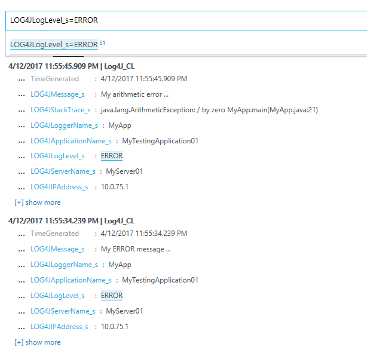

# Experimental log4j appender for OMS
This **experimental** appender collects data from log4j and in async way sends data to OMS REST API for processing.

## How to compile and test
* go to directory `log4j-oms-appender`
* compile by `mvn clean install`
* than go to directory `testapp`
* update file `./src/main/resources/log4j.properties` 
  * enter valid `log4j.appender.oms.customerId` and `log4j.appender.oms.sharedKey` - vaules depends on your deployed OMS instance
* compile by `mvn clean package`
* and run our testapp ...

after while you will see in OMS some cool new records of your custom type from application ...

